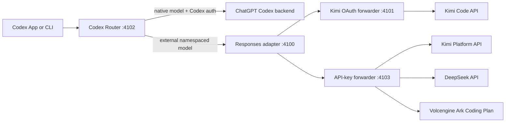

# Codex Router

Use Kimi, DeepSeek, Volcengine Ark Coding Plan, and future external models from
the normal Codex model picker without replacing native GPT models or your
ChatGPT sign-in.

Codex Router is an independent community project. It is not affiliated with
OpenAI, Moonshot AI, DeepSeek, OpenRouter, or the referenced opencodex project.

## Give the link to Codex

Paste this into a Codex task:

```text
Install Codex Router from this public repository:
https://github.com/xiangyingchang/codex-router

Follow AGENTS.md. Preserve my existing Codex model, profiles, settings, and
ChatGPT login. Detect and safely migrate only recognized older versions, show
only providers whose authentication I choose, run the doctor, and leave the
final Codex restart to me. Never ask me to paste a token or API key into chat.
```

If a compatible credential already exists, Codex can complete everything except
the final app restart. API keys are entered only in a hidden terminal prompt.

## Or run the guided installer

macOS or Linux:

```sh
curl -fsSL https://raw.githubusercontent.com/xiangyingchang/codex-router/main/install.sh | sh -s -- --guided
```

Windows PowerShell:

```powershell
$installer = Join-Path $env:TEMP "codex-router-install.ps1"
Invoke-WebRequest https://raw.githubusercontent.com/xiangyingchang/codex-router/main/install.ps1 -OutFile $installer
powershell.exe -NoProfile -ExecutionPolicy Bypass -File $installer -Guided
```

The setup asks which providers to show, detects existing authentication, offers
to run `kimi login`, prompts invisibly for API keys, takes a rollback snapshot
of recognized older routers, installs the background service, and verifies the
result. It never makes a paid test request unless `--smoke-test` is explicitly
selected.

Requirements:

- Codex App or Codex CLI, already signed in for native GPT models.
- Node.js 22.19 or newer; Node.js 24 LTS is recommended.
- `uv`, or Python 3.10+ with `venv`.
- Git for the one-command managed checkout.

The desktop app is supported on macOS and Windows. Linux installations target
the Codex CLI and use a systemd user service.

## Models and authentication

| Picker label | Model ID | Authentication |
| --- | --- | --- |
| Kimi K3 (OAuth) | `kimi-oauth/k3` | Existing Kimi Code CLI OAuth session |
| Kimi K3 (API) | `kimi-api/kimi-k3` | Separately billed Kimi Platform API key |
| DeepSeek V4 Flash (API) | `deepseek/deepseek-v4-flash` | DeepSeek API key |
| DeepSeek V4 Pro (API) | `deepseek/deepseek-v4-pro` | DeepSeek API key |
| Doubao Seed 2.0 Code (Ark) | `ark-coding/doubao-seed-2.0-code` | Ark Coding Plan API key |
| Doubao Seed 2.0 Pro (Ark) | `ark-coding/doubao-seed-2.0-pro` | Ark Coding Plan API key |
| Doubao Seed 2.0 Lite (Ark) | `ark-coding/doubao-seed-2.0-lite` | Ark Coding Plan API key |
| Doubao Seed Code (Ark) | `ark-coding/doubao-seed-code` | Ark Coding Plan API key |
| MiniMax M2.7 (Ark) | `ark-coding/minimax-m2.7` | Ark Coding Plan API key |
| MiniMax M3 (Ark) | `ark-coding/minimax-m3` | Ark Coding Plan API key |
| GLM 5.2 (Ark) | `ark-coding/glm-5.2` | Ark Coding Plan API key |
| DeepSeek V4 Flash (Ark) | `ark-coding/deepseek-v4-flash` | Ark Coding Plan API key |
| DeepSeek V4 Pro (Ark) | `ark-coding/deepseek-v4-pro` | Ark Coding Plan API key |
| Kimi K2.6 (Ark) | `ark-coding/kimi-k2.6` | Ark Coding Plan API key |
| Kimi K2.7 Code (Ark) | `ark-coding/kimi-k2.7-code` | Ark Coding Plan API key |

Kimi Code OAuth and Kimi Platform API access are separate authentication and
billing systems. The two Kimi entries intentionally coexist.

The older `deepseek-chat` and `deepseek-reasoner` aliases remain hidden
compatibility routes for existing CLI commands, but are not advertised to new
users because their upstream lifecycle is provider-controlled.

Only enabled providers appear in the picker. Manage them later with:

```sh
./bin/providers
./bin/providers enable deepseek
./bin/providers enable ark-coding
./bin/providers disable kimi-api
```

On Windows, use `./codex-router.ps1` in PowerShell, for example:

```powershell
./codex-router.ps1 providers
./codex-router.ps1 provider-key deepseek set
```

Credentials can also be prepared directly:

```sh
kimi login
./bin/provider-key kimi-api set
./bin/provider-key deepseek set
./bin/provider-key ark-coding set
```

The API-key prompt disables terminal echo. Protected files use mode `600` on
POSIX systems and an inheritance-disabled, current-user ACL on Windows. The
router checks only credential presence in diagnostics and never prints values.

## Make Kimi appear in Codex

After setup:

1. Run `./bin/doctor` and resolve any `FAIL` line.
2. Confirm `./bin/providers` says `SHOW` and `ready` for Kimi OAuth or Kimi API.
3. Fully quit Codex—not just its window—then reopen it.
4. Create a new task and open the model picker.

The catalog override is loaded only at app startup. If Kimi still does not
appear, run `./bin/refresh-catalog`, quit Codex fully, and reopen it.

## Safe repair and support

```sh
./bin/doctor                         # checks plus exact remedies
./bin/doctor --fix                   # rebuild and reinstall safe managed state
./bin/doctor --fix --migrate-known   # also snapshot/migrate a recognized old router
./bin/smoke-test                     # optional billed live response per provider
./bin/support-bundle                 # private metadata-only JSON bundle
```

Support bundles exclude credential values, prompts, provider responses, and log
contents by default. `--include-logs` adds a redacted tail but may still contain
private prompt or response text; inspect it before sharing.

The installer recognizes the earlier `io.github.kimi-codex-router` installation
and the `com.ziwenxu.kimi-codex-proxy` prototype. It stops them, preserves their
state, moves service definitions into a protected snapshot, and can restore the
exact previous config:

```sh
./bin/migrate detect
./bin/migrate rollback
```

Unknown routers, unmarked user-owned base URLs, and unrecognized model catalogs
are never overwritten or killed automatically.

## Updates and rollback

For a managed Git checkout:

```sh
./bin/update
./bin/rollback
```

Updates require a clean `main` checkout and a recognized repository origin. The
previous revision is retained as a local rollback ref. If installation of an
update fails, the updater automatically reinstalls the previous revision.

Tagged releases contain `.tar.gz` and `.zip` source archives, SHA-256 checksums,
and GitHub build-provenance attestations. Review `SHA256SUMS` on the release page
when installing a pinned release.

## What changes in Codex

The installer adds only this marked root block to `~/.codex/config.toml` (or
`%USERPROFILE%\.codex\config.toml`):

```toml
# BEGIN codex-router-managed
openai_base_url = "http://127.0.0.1:4102/v1"
model_catalog_json = "/absolute/path/to/.codex/codex-router/merged-models.json"
# END codex-router-managed
```

It does not set or replace `model`, `model_provider`, reasoning effort,
profiles, project trust, MCP settings, or ChatGPT authentication. The first
config change is backed up as `config.toml.pre-codex-router`.

Codex supports `openai_base_url` for the built-in OpenAI provider and
`model_catalog_json` as a startup model-catalog override. Keeping the built-in
provider is what lets external named models coexist with native GPT models
instead of appearing as one generic `Custom` entry.

## How routing works



Codex uses the Responses API. The current external providers expose compatible
Chat Completions APIs, so the pinned LiteLLM adapter translates responses,
streaming, tool calls, and compaction traffic. All listeners bind to
`127.0.0.1`.

Codex authentication headers are allow-listed only for native requests.
External routes receive a random internal loopback key; the final forwarder
discards it and injects only the selected provider credential.

Ark Coding Plan uses its dedicated OpenAI-compatible endpoint,
`https://ark.cn-beijing.volces.com/api/coding/v3`. Do not substitute the
separately billed `/api/v3` endpoint. The `glm-latest` upstream alias remains
available as the hidden route `ark-coding/glm-latest` for CLI compatibility.

## Add future providers and models

[`config/providers.json`](config/providers.json) is the validated registry for
provider metadata, picker entries, upstream IDs, context windows, request
profiles, and credential sources. Standard OpenAI-compatible providers share
one credential-isolating forwarder.

Discovery deliberately does not publish every returned model blindly:

```sh
./bin/discover-models deepseek
./bin/test-model 'deepseek/deepseek-v4-pro' --live --yes
```

The first command compares the official `/models` response with the registry
without exposing the API key. The second is an explicitly billed compatibility
suite covering basic responses, streaming, tool calls, and compaction. A model
should enter the picker only after its official capabilities and live Codex
behavior are verified.

See [Development](docs/DEVELOPMENT.md) for the registry contract and extension
checklist.

## Commands and guides

```sh
./bin/setup --guided
./bin/status
./bin/doctor
./bin/providers
./bin/refresh-catalog
./bin/disable
./bin/enable
./bin/uninstall
```

- [Installation, migration, and upgrades](docs/INSTALL.md)
- [Troubleshooting](docs/TROUBLESHOOTING.md)
- [Architecture and request flow](docs/HOW-IT-WORKS.md)
- [Security and credential handling](SECURITY.md)
- [Provider development and tests](docs/DEVELOPMENT.md)
- [Changelog](CHANGELOG.md)

References: [Kimi Code CLI OAuth](https://www.kimi.com/help/kimi-code/cli-getting-started),
[Kimi K3 API](https://platform.kimi.com/docs/guide/kimi-k3-quickstart),
[DeepSeek model API](https://api-docs.deepseek.com/api/list-models),
[Codex advanced configuration](https://learn.chatgpt.com/docs/config-file/config-advanced),
and [opencodex](https://github.com/lidge-jun/opencodex).

MIT licensed. See [LICENSE](LICENSE) and [NOTICE.md](NOTICE.md).