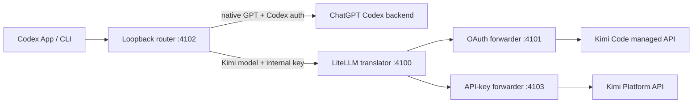

# Kimi K3 for the Codex App

Add Kimi K3 to the normal Codex model picker while keeping native OpenAI models,
your existing Codex login, default model, provider, and profiles intact.

The picker gains two entries:

- `Kimi K3 (OAuth)` uses the existing Kimi Code CLI OAuth session.
- `Kimi K3 (API)` uses a separately billed Kimi Platform API key.

This is a macOS-first, local community integration inspired by
[opencodex](https://github.com/lidge-jun/opencodex). It is not affiliated with
OpenAI, Moonshot AI, or the Kimi Code team.

## Quick start

Prerequisites: the Codex App, Node.js 22.19+, `uv` or Python 3.10+, and either a
Kimi Code OAuth login or Kimi Platform API key.

```sh
# OAuth users: install Kimi Code CLI first, then authenticate once.
kimi login

# From this repository:
./bin/install
```

Fully quit Codex with `Command-Q`, reopen it, and start a new task. Select
`Kimi K3 (OAuth)` in the model picker.

To enable the separately billed API route:

```sh
./bin/api-key set
```

The API entry is always visible, but returns a clear setup error until a real
API key is configured. OAuth credentials are not reused as API keys because
the two Kimi services have separate authentication and billing.

## What the installer changes

The installer adds only this managed block to the root of
`~/.codex/config.toml`:

```toml
# BEGIN kimi-codex-router-managed
openai_base_url = "http://127.0.0.1:4102/v1"
model_catalog_json = "/absolute/path/to/.codex/kimi-router/merged-models.json"
# END kimi-codex-router-managed
```

It does not set `model`, `model_provider`, `model_reasoning_effort`, or any
profile. A backup is created at `~/.codex/config.toml.pre-kimi-router` the first
time configuration is changed.

Codex officially supports `openai_base_url` for pointing the built-in OpenAI
provider at a proxy and `model_catalog_json` as a startup model-catalog
override. Keeping the built-in provider is what makes Kimi appear as named
models instead of replacing the picker with a generic `Custom` provider.

## Commands

```sh
./bin/status             # concise config, service, and health state
./bin/doctor             # layered diagnostics
./bin/api-key status     # API-key presence only; never prints the key
./bin/refresh-catalog    # refresh native models after a Codex update
./bin/disable            # remove integration and stop the service
./bin/enable             # restore integration and service
./bin/uninstall          # remove integration/service; retain secrets and logs
```

CLI model IDs work after installation too:

```sh
codex --model 'kimi-oauth/k3'
codex --model 'kimi-api/kimi-k3'
```

## How it works



Codex speaks the Responses API, while Kimi exposes an OpenAI-compatible Chat
Completions interface. LiteLLM performs the protocol translation. The router
keeps native GPT traffic on the normal ChatGPT Codex path and sends only the
two namespaced Kimi model IDs through the translator.

Codex authentication headers are allow-listed only for the native route. Kimi
routes receive a generated internal service key instead, and each forwarder
replaces that key with its own Kimi credential. All four listeners bind only to
`127.0.0.1`.

See [How it works](docs/HOW-IT-WORKS.md) for request flow, model catalogs,
compression, tool calls, and compaction.

## Guides

- [Installation and upgrades](docs/INSTALL.md)
- [Architecture and request flow](docs/HOW-IT-WORKS.md)
- [Security and credential handling](SECURITY.md)
- [Troubleshooting](docs/TROUBLESHOOTING.md)
- [Development and tests](docs/DEVELOPMENT.md)

## Current scope

- Automatic service installation supports macOS `launchd`.
- The router intentionally declines Responses WebSocket upgrades; current Codex
  falls back to compressed HTTP automatically.
- Kimi CLI OAuth credential storage is an implementation detail of Kimi Code.
  A future CLI release can require an adapter update.
- Kimi K3 API requests are forced to `reasoning_effort = "max"`, matching the
  current K3 API requirement.

## References

- [Kimi Code CLI setup and OAuth login](https://www.kimi.com/help/kimi-code/cli-getting-started)
- [Kimi K3 API quickstart](https://platform.kimi.com/docs/guide/kimi-k3-quickstart)
- [Codex advanced configuration](https://learn.chatgpt.com/docs/config-file/config-advanced)
- [opencodex](https://github.com/lidge-jun/opencodex)

MIT licensed. See [LICENSE](LICENSE) and [NOTICE.md](NOTICE.md).
