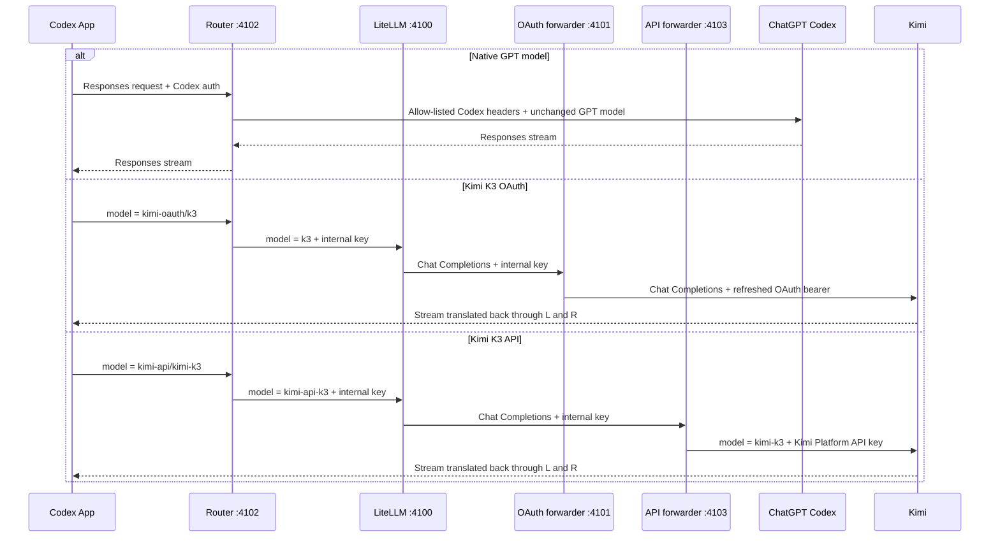

# How it works

## Why a router is needed

Codex can point its built-in OpenAI provider at a custom base URL, but the App
still expects the Responses API and a Codex-shaped model catalog. Kimi's coding
and platform endpoints are OpenAI-compatible Chat Completions services.

This project bridges those two differences without replacing the built-in
provider:

- A merged catalog makes the Kimi entries visible beside native GPT models.
- A dispatcher routes by namespaced model ID.
- LiteLLM translates Responses requests and streams to Chat Completions.
- Dedicated forwarders supply either Kimi OAuth or a Kimi Platform API key.

## Request flow

## Model catalog integration

`src/catalog.mjs` asks the installed Codex binary for its current model catalog,
stores that native snapshot, and adds two entries:

| Picker label | Public model ID | Internal LiteLLM model |
|---|---|---|
| Kimi K3 (OAuth) | `kimi-oauth/k3` | `k3` |
| Kimi K3 (API) | `kimi-api/kimi-k3` | `kimi-api-k3` |

The native objects are preserved rather than recreated, so current GPT model
metadata, availability, and reasoning controls remain whatever the installed
Codex build supplied.

The installer deliberately does not create a custom `model_provider`. It keeps
the built-in `openai` provider and sets only `openai_base_url`, matching Codex's
documented proxy configuration. This is why the picker contains named Kimi
models instead of only `Custom`.

## Authentication boundaries

| Route | Credential received from Codex | Credential sent upstream |
|---|---|---|
| Native GPT | Codex/ChatGPT bearer and selected allow-listed session headers | Same Codex credential to the ChatGPT Codex backend |
| Kimi OAuth | Discarded at the dispatcher | Kimi CLI OAuth bearer from `~/.kimi-code` |
| Kimi API | Discarded at the dispatcher | Kimi Platform API key |

The internal router-to-LiteLLM and LiteLLM-to-forwarder hops use a random key
generated during installation. Functional forwarder routes reject requests
without that key. Health endpoints reveal only availability and whether a
credential exists.

## OAuth refresh

The OAuth adapter reads the credential created by `kimi login`. Before a Kimi
request it checks expiry metadata and refreshes when necessary. Refresh writes
use an atomic temporary-file rename and mode `600`.

A cross-process lock prevents the router and Kimi CLI from refreshing the same
credential concurrently. Tokens and refresh responses are never included in
logs or health output.

## Request compression and WebSockets

Current Codex builds first try a Responses WebSocket. The router returns HTTP
`426`, which makes Codex use its normal HTTP fallback. Codex may Zstandard-
compress that fallback body, so the dispatcher supports bounded Zstandard,
gzip, deflate, and Brotli decompression before inspecting the model ID.

Native and Kimi upstream requests are then reserialized as plain JSON. Incoming
content encoding and length headers are never forwarded blindly.

## Tools and streaming

LiteLLM converts Codex Responses input, function declarations, function calls,
tool outputs, image inputs, and streaming events to and from Kimi's Chat
Completions representation. The OAuth adapter also repairs an edge case where
translated assistant text can appear between a tool call and its required tool
result.

Codex remains the agent runtime. It still owns approvals, sandboxing, shell
commands, MCP tools, skills, and task history; only model inference is routed.

## Context compaction

Because the built-in OpenAI provider advertises remote compaction, Codex can
send either `/responses/compact` or a `compaction_trigger` item. Kimi cannot
produce OpenAI's opaque encrypted compaction payload, so the router asks Kimi
for a concise continuation summary and returns a Codex-compatible replacement
history.

For v2 compaction, the summary is wrapped in a local `kcr1:` base64 envelope.
On replay, only this router decodes it back into a plain continuation message.
The envelope is encoding, not encryption, and never contains credentials.
